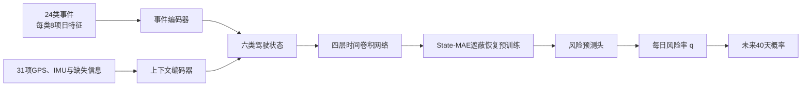

# 任务一事故风险预测算法与模型说明（V12）

**模型版本：V12 State-MAE**  
**任务目标：根据每辆车连续60天的驾驶记录，预测随后40天发生事故或未遂事故的风险。**

## 一、从零散报警中还原一条风险演化过程

事故通常不是突然出现的。司机可能先出现疲劳、分心或超速，随后车辆控制变得不稳定，进一步出现车距过近、碰撞预警等近端险情，最终才可能发展为未遂事故或事故。

比赛数据记录了这条过程中的许多碎片：事件报警告诉我们发生了什么，GPS告诉我们车辆开了多远、多久、在什么时段行驶，IMU告诉我们车辆是否出现剧烈加速、转向或振动。任务一要做的，是把60天内这些零散记录连成一段驾驶状态变化，再据此判断未来40天的整体风险。

处理顺序为：**原始事件、GPS和IMU → 每日驾驶记录 → 六类驾驶状态 → 60天状态变化 → 每日事故风险率 → 未来40天事故概率**。

模型最终输出三个字段：`gpsno`、`prediction`和`probability`。

其中`probability`表示未来40天发生至少一次事故或未遂事故的概率，`prediction`按照固定阈值0.5转换为0或1。赛题主要使用ROC-AUC评价车辆风险排序。

## 二、把60天数据整理成“每日驾驶日记”

原始事件、GPS和IMU数据量较大，而且记录频率不同。预处理先把它们统一汇总成`500辆车 × 60天`的日级数据表。每一行就是一辆车某一天的驾驶日记。

### 1. 行为事件

模型保留全部24类事件，不先用人工权重把它们加成一个总分。每种事件每天记录八类信息：

- 原始触发次数；
- 去除连续重复报警后的独立报警段数；
- 每百公里发生率；
- 每驾驶小时发生率；
- 当天是否出现；
- 里程是否可靠；
- 驾驶时长是否可靠；
- 夜间驾驶占比。

同时保留次数和单位里程、单位时间发生率，可以避免把“开得多”简单判成“更危险”。极端大值经过`log1p`和训练集分位数截尾处理，减少少量异常记录对模型的影响。

### 2. GPS驾驶暴露

GPS用于描述车辆当天实际承担了多少驾驶任务，包括：

- 行驶里程和驾驶时长；
- 夜间里程占比；
- 行程次数；
- 典型速度和高速区间速度；
- 速度变化和转向变化；
- 轨迹长时间中断和异常记录数量。

绝对经纬度不进入模型。模型关注的是驾驶暴露和行驶方式，避免记住具体车辆常跑的地点。

### 3. IMU车辆运动

IMU数据先按10秒短时间窗汇总，再聚合到每天。模型使用加速度模长、角速度模长、峰值、分位数和波动程度，捕捉急刹、急转、冲击和车辆不稳定等现象。

### 4. 缺失也是信息

“当天没有危险事件”和“设备当天没有记录”含义完全不同。因此，每个连续特征都配有缺失标记，并另外记录当天是否有轨迹、是否有IMU、是否为已经确认的静止日。缺失值只用当前训练车辆的中位数填充，验证车辆不会参与截尾、填补和标准化参数计算。

## 三、用六类状态理解驾驶风险

单个事件的含义有限。V12把24类事件和31项上下文进一步整理为六类驾驶状态：

| 状态 | 模型关注的问题 | 代表性信息 |
|---|---|---|
| 暴露机会 O | 当天有多少驾驶和冲突机会 | 里程、时长、夜间驾驶、盲区报警 |
| 上游危险行为 U | 司机是否处在高风险驾驶状态 | 疲劳、分心、看手机、各类超速 |
| 控制稳定性 C | 车辆操控是否开始失稳 | 车道偏移、压线、低头、IMU剧烈变化 |
| 近端险情 P | 是否已经接近碰撞 | 前碰撞预警、车距过近 |
| 严重历史 H | 是否已经发生严重结果 | 事故、未遂事故 |
| 证据质量 Q | 当前记录是否可信 | 摄像头遮挡、角度异常、轨迹和IMU缺失 |

其中，`O`表示驾驶暴露条件，`Q`表示记录是否可信，两者用于校正风险和判断证据质量。真正描述风险演化阶段的是`U、C、P、H`，即：**疲劳、分心、超速等上游风险 → 车辆控制逐渐不稳定 → 碰撞预警、车距过近等近端险情 → 未遂事故或事故**。

人工分组只给模型一个起点。模型内部使用可学习的软归属，一个事件可以同时影响多个状态。例如“频繁低头”既可能反映注意力问题，也可能影响车辆控制。最终重要程度由数据学习，而不是由人工固定。

每个状态每天形成一个32维向量。随后，四层时间卷积网络读取截至当前预测时点的全部历史，识别长期习惯、近期状态和风险是否正在恶化；正式第60天推理时才读取完整60天。时间网络不会看到预测时点之后的数据。

## 四、先学会理解驾驶状态，再学习事故风险

事故和未遂事故样本有限，直接训练神经网络容易把偶然现象记住。V12先进行一次不依赖未来事故标签的表征学习。

训练时，模型会主动遮住一部分已经观察到的记录，例如连续遮住几天的疲劳与分心状态，或者遮住某类事件的完整记录，再要求模型根据剩余历史恢复被遮住的内容。模型由此学习相邻日期和不同风险状态之间的联系。

预训练同时恢复：

- 某种事件是否发生；
- 事件发生后的强度；
- GPS和IMU上下文；
- 被遮住日期的隐藏驾驶状态。

原本就缺失的数据不计算恢复误差，避免模型把“没有观测”学成“安全零值”。观测期内已经发生的`11803/11804`属于当日驾驶历史，可以参加同日遮蔽恢复；相对于更早的预测时点，同一事件又可以作为监督风险头的未来结果。它们不会被设置为“预测未来事故”的自监督目标，因此自监督恢复任务和事故监督任务各自使用清楚的时间边界。

这种方法称为State-MAE。它先让模型理解什么是正常、异常、持续和恶化的驾驶状态，再使用事故结果训练最终风险预测头。

## 五、怎样在只有60天数据时构造训练目标

最终任务要求用前60天预测之后40天，但本地没有第61—100天的真实结果。因此，本地训练使用观测期内较早的预测时点：

| 预测时点 | 已看到的历史 | 能观察到的后续结果 |
|---:|---:|---:|
| 第14天 | 14天 | 40天 |
| 第20天 | 20天 | 40天 |
| 第30天 | 30天 | 30天 |
| 第40天 | 40天 | 20天 |
| 第50天 | 50天 | 10天 |
| 第53天 | 53天 | 7天 |

模型预测从当前预测时点开始，每天第一次发生事故或未遂事故的风险率`q`。这里的“第一次”是指预测时点之后的首次`11803/11804`，并非车辆生命周期中的第一次；预测时点之前已经发生过事故的车辆仍可参加后续时点训练。

模型假设给定当前历史后，未来窗口内每日条件风险率近似保持为同一个`q`，因此未来`H`天至少发生一次的概率为 **`pH = 1 - (1 - q)^H`**。

这个简化让不同长度的可观察窗口可以共同训练，也意味着40天概率的校准依赖“短期日风险可以外推”的假设。如果某个预测时点之后发生了事故，损失同时要求模型学会“事故前一直没有发生”和“事故当天发生”；如果一直没有事故，则只计算实际观察到的天数。看不到的未来不会被填成零，这就是右删失处理。

同一辆车的多个预测时点先在车内平均损失，再在车辆之间平均，避免把一辆车的六个时间点当成六辆独立车辆。

## 六、模型结构

风险预测头同时读取：

- 截至当前预测时点的长期平均状态（正式推理时为60天）；
- 最近14天状态；
- 最近7天相对前7天的风险变化。

对照网络的总参数约12万，最终State-MAE实际参与风险预测的参数约4.8万。网络保持较小，是因为可监督车辆只有数百辆；扩大到数千万参数会明显增加过拟合和结果波动。

## 七、训练和参数设置

| 项目 | 设置 |
|---|---:|
| 状态宽度 | 32 |
| 时间网络 | 4层，膨胀系数1、2、4、8 |
| Dropout | 0.10 |
| State-MAE预训练 | 1500步 |
| 预训练批量 | 64辆车序列 |
| 预训练学习率 | `3e-4` |
| 风险微调批量 | 512 |
| 编码器学习率 | `1e-4` |
| 风险头学习率 | `1e-3` |
| Weight decay | `1e-3` |
| 梯度裁剪 | 1.0 |
| 微调轮数范围 | 15–60轮 |
| 最终固定轮数 | 18轮 |
| 随机种子 | 2026 |

本地评估采用车辆级五折交叉验证。当前保存的五折评估集包含382辆车，所有这些车辆都只属于一个验证折；每轮使用其余四折训练，五轮结束后，每辆车恰好得到一次没有参与自身训练的折外预测。

数据中的500辆目标车用途如下：382辆用于本地五折评估和最终模型训练，另外96辆具有匹配事件信息的车辆只生成最终预测、不计入本文本地指标；22辆没有可靠行为证据，最终使用低证据回退值。正式提交仍覆盖全部500辆车。

同一辆车的全部日期和预测时点始终位于同一折。每折的数值处理、自监督预训练、轮数选择和风险微调都只使用该折训练车辆。外折验证车辆不会参与预训练，也不会决定早停轮数。

## 八、最终输出

模型确定后，使用固定的1500步State-MAE预训练和18轮风险微调重新训练，再读取每辆车完整60天历史，为全部500辆车生成结果。

478辆具有匹配事件信息的车辆使用完整模型。其余22辆车既没有匹配事件源，也没有可观察轨迹或IMU行为。对这些车辆直接给低分或低风险都没有依据，因此使用五折训练样本的20→40正例先验`119/382≈0.3115`，并标记为低证据车辆。

正式结果包含500个唯一车辆编号，无缺失概率，二分类结果与0.5阈值一致。
